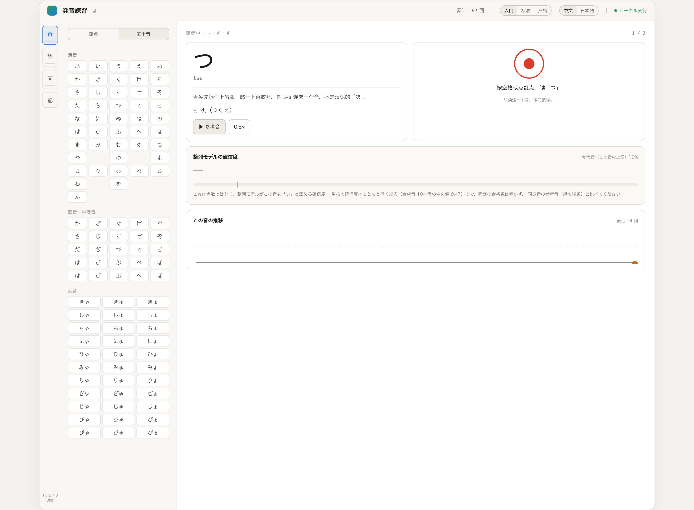
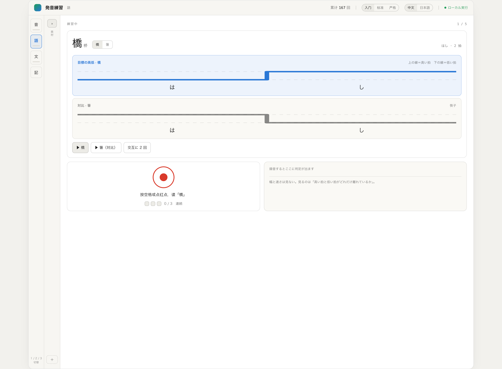
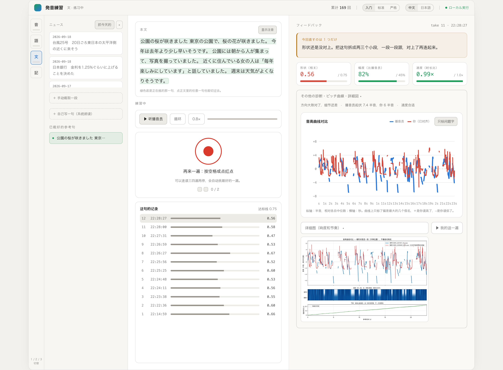

# 発音練習 — Japanese Pronunciation Practice

**A local tool for practising Japanese pronunciation, built around three graded modes.**
Drill the sounds Chinese speakers stumble on, then word pitch accent with minimal pairs,
then shadow NHK news sentences. Pitch targets come from an offline accent dictionary, not
from guesswork; scoring is Praat + DTW. Nothing leaves your machine.

---

## 这是什么

练日语发音时最难的是——**你知道自己读得不像，但不知道哪里不像**。

这个工具把「不像」拆成三层，一层一层练：

| 模式 | 练什么 | 反馈 |
|---|---|---|
| **音** | 按中国人难点分组的单音，外加完整五十音図 | 对齐模型的确信度，和同一个音的参考音比 |
| **語** | 最小对（橋/箸、雨/飴…）的高低走向 | 高拍和低拍差几个半音 |
| **文** | NHK 新闻句子跟读 | 形状/幅度/速度三个分数 + 逐字假名 |
| **記録** | 三个模式共用 | 难点音长期趋势 + 已经练稳的词句 |

三个模式不锁，随时跳。数据全部留在本机。

### 模式① 音 — 单音



左边可以按**难点分组**（つ・ず・す / 長音 / 促音 / ら行 / ん / 清濁）看，也可以切到**完整五十音図**（清音 / 濁音・半濁音 / 拗音，共 104 个音）点任意一个练。

确信度直接取对齐模型的 posterior，**不是自己造的分数**。它不设固定合格线——单拍确信度本来就低（104 个合成音实测中位只有 0.47，「ま」0.96 而「つ」0.22，跟你读得准不准无关），所以绿色竖线是**同一个音的参考音能达到的上限**，你跟它比。

### 模式② 語 — 单词声调



蓝色是要练的那个词的目标高低，灰色是对比词。**两侧都能练**——惯性读成高低还是低高因人而异，只练一侧等于只学会一半。

判定只看一件事：**高拍和低拍差了几个半音**，不看幅度和速度（那是模式③ 的事）。给的是带符号的数，不是对错——两拍差不到 1 个半音时二值判定等于掷硬币（实测有的合成音两拍相差 0.0 半音，硬判会得出日语里不存在的「低低」）。参照值：NHK 播音员一篇新闻 45 个アクセント句的高低差中位是 **2.6 个半音**。

### 模式③ 文 — 句子跟读



正文常驻中栏，**正在练的那一句绿底高亮，点正文里任意一句就切过去**。右边反馈栏最上面永远只说**一件事**——把所有问题一起亮红，人会想同时改，结果都改不好。其余诊断、音高曲线、详细图默认收起。

挑选顺序是 **调型 > 幅度 > 速度**，取偏差最大的那一拍。同一条连着说两遍会换个说法，连着四遍还不过就提议先去模式① 单独练那个音。

---

## 安装

需要 **Python 3.10+** 和 **ffmpeg**。

> 在 **macOS（Apple Silicon，Python 3.13）** 上验证过。Windows 命令没人实际跑过，
> 而且**模式① 和模式② 目前是 macOS 专属**，见「[已知限制](#已知限制)」。

```bash
# 1. ffmpeg
brew install ffmpeg
ffmpeg -version

# 2. 代码和依赖
git clone <这个仓库的地址>
cd shadowing
python3 -m venv .venv
source .venv/bin/activate
pip install -r requirements.txt

# 3. 自检（不联网，几秒钟）
python selftest.py

# 4. 启动
python app.py
```

终端会打印 `打开浏览器访问 http://localhost:8765`（端口被占会自动往后找到 8774）。

**只装必选依赖的话，能用的是模式③ 的基本跟读。** 三个模式完整可用还需要下面这个。

### 可选依赖（模式①② 和目标台阶要用）

```bash
pip install -r requirements-align.txt
```

装的是三样东西，加起来约 2GB：

- **torch / torchaudio** — Meta MMS 强制对齐模型，把录音对到每个假名上。第一次用会下载约 1.2GB 模型
- **pyopenjtalk** — 调型词典，目标高低从这里查。词典首次运行时下载约 23MB，解压后 107MB
- **pykakasi** — 没有注音的汉字用它猜读音

不装的话：模式①② 显示不可用，模式③ 的目标台阶和逐字假名反馈不出现，**三个分数照常**。

---

## 每天怎么用

`1` / `2` / `3` 切模式，`空格` 录音，`R` 重听参考。

### 准备材料

**有 NHK cookie**（配置见下节）：点「抓今天的」，正文和音频自动下来，按停顿切成句子。

**没有 cookie 也能用**：

- 左栏「自己写一句」打一句日语，系统朗读生成参考（macOS）
- 或手动放一篇进 `news/`：一个音频（`.m4a` / `.mp3`）和一个**同名** `.txt`

```
news/2026-09-20/01_桜.m4a
news/2026-09-20/01_桜.txt
```

`.txt` 格式是「第 1 行标题，第 2 行来源链接（可留空），第 3 行空行，之后正文」。
正文的汉字要用 **NHK 式 `漢字（かな）` 全角括号注音**——正文注音显示、假名对齐、调型查询三处都靠它：

```
公園（こうえん）の桜（さくら）が咲（さ）きました


東京（とうきょう）の公園（こうえん）で、桜（さくら）の花（はな）が咲（さ）きました。
今年（ことし）は去年（きょねん）より少（すこ）し早（はや）いそうです。
```

**一句一句练，比整篇跟读有效得多**，参考句超过 6 秒页面会提示你截短。

### 练一句

1. 点一个句子候选 → 成为当前参考
2. 想要目标台阶和逐字反馈，先点「**按假名对齐这篇**」（一篇 10–60 秒，结果会缓存）
3. 参考自动播放，`R` 重听，`0.8×` 放慢（对真人录音也管用）
4. **空格**开始录音，读三四遍再停，会自动挑最好的一遍
5. 看「只改一件事」，改完再录

所有文件都在仓库目录：`news/` 新闻、`segments/` 参考句、`recordings/` 录音、`results/` 对比图、`history.jsonl` 分数。

### 录音会自动清理

每个练习对象只留「**最好 1 条 + 最近 3 条**」，其余连同对比图删掉；参考句被删时它的录音全清。三个触发点：启动时扫全部、录完清当前对象、删参考句时级联。

**分数永远保留**——`history.jsonl` 很小，記録页的趋势和「安定」判定全靠它。被清理掉的那几遍只是听不回来，分数还在。

---

## 配置 NHK 抓取（约 2 分钟）

NHK 在 2026 年改版（NHK ONE）后，正文和音频都要先在浏览器同意一次「ご利用にあたって」。脚本**不碰你的浏览器**，cookie 由你自己复制：

1. 浏览器打开 <https://news.web.nhk/news/easy/>，弹出同意页就点同意
2. `F12` → **Network** → 刷新 → 点任意一条发往 `news.web.nhk` 的请求 → **Request Headers** → 复制 `Cookie:` 后面一整行
3. 在仓库目录执行 `nano nhk_auth.txt`，粘到**第 1 行**，`Ctrl+O` 回车，`Ctrl+X`
   - 不要用 macOS「文本编辑」，它默认存富文本（脚本会检测出来并提示）
4. 音频报「缺少 z_at」时：`F12` → **Console** → `localStorage.getItem('z_at')`，结果（**不含引号**）粘到**第 2 行**

音频走 HLS 分片下载，存成 `.m4a`：优先 `-c:a copy` 原样拷贝 NHK 的 AAC，不做二次有损压缩；
某些 AAC 配置下 mp4 容器需要的比特流过滤器 ffmpeg 未实现，这时退而重编码成 AAC 128k。
抓完拿播放列表里 `#EXTINF` 之和验收时长——分片掉几个时 ffmpeg 常常照样返回成功，只看返回码查不出来。

单独抓一篇：`python fetch_nhk.py --url <文章地址>`；
重下已有文章的音频（文件名不变，会清掉过期的对齐缓存）：`python fetch_nhk.py --redo`。

**`nhk_auth.txt` 是你的会话凭证**，已在 `.gitignore` 里，不要发给别人。会过期，401/403 基本都是它，重做一遍即可。

NHK 没有公开 API，脚本用的是网页背后的接口，NHK 再改版时可能整个失效。

---

## 怎么看分数

### 模式③ 的三个数

顶栏可以切**难易度**，三档的目标线不同：

| 难度 | 形状 | 幅度 | 速度 | 需连续 |
|---|---|---|---|---|
| 入门 | ≥ 0.75 | ≥ 45% | 0.70–1.45× | 2 次 |
| **标准**（默认） | ≥ 0.82 | ≥ 58% | 0.78–1.30× | 3 次 |
| 严格 | ≥ 0.88 | ≥ 68% | 0.84–1.22× | 4 次 |

这三档不是拍脑袋定的，是拿作者 190 次真实录音标定的，单次达标率约 **58% / 26% / 8%**。
设计稿原本要求「形状 0.90 连续 6 次」——同一批数据里只有 0.5% 达标，实际上永远触发不了。

- **形状**（对齐后两条音高曲线的相关系数）最重要。对着图看哪一段红线和蓝线反着走，单独把那个词读几遍。日语的音高是词本身自带的，靠猜猜不对。
- **幅度**小 = 方向对了但没做出来，读得太平。夸张一点，宁可过头。
- **速度**偏慢通常是每个音节都拖了一点点，而不是某处停顿太久——看节奏图能确认。

### 目标台阶

只有**高／低两档**——日语音高本来就是二值的，画成连续曲线反而把人引回「看曲线」的老路。

调型查的是 OpenJTalk 内置的调型词典，不是从录音音高反推的。**后者测到的是句子整体下降调，不等于词本身的调型**。10 组教科书级最小对实测全部命中，包括尾高和平板的区分（两者单独读都是低高，接助词才分家）。

词典的拍和对齐模型的拍记法不同（`とおい`/`とーい`、`は`/`わ`、`こう`/`こー`），归一化后覆盖率约 **98%**；**对不上的拍会留空、假名淡显，不画也不判错**——宁可不显示，也不给一个看起来权威其实是蒙的答案。

---

## 打包成双击就能开的程序（可选）

先把**静态编译**的 ffmpeg 放进 `bin/`（下载地址见 [bin/README.md](bin/README.md)）。

```bash
bash build_mac.sh            # 得到 dist/跟读练习.app
```

第一次打开要**右键 → 打开**。数据放在 .app 旁边的 `ShadowingData/` 里。

**Windows**：仓库里有 `build_win.bat`，但**从来没有在 Windows 上运行过**。

---

## 已知限制

- **模式① 和模式② 目前是 macOS 专属**——参考音靠 macOS 的 `say` 合成，模式① 的确信度基线也要它。其它系统上这些入口会自动隐藏。**模式③ 跟读（比对 NHK 播音员真人录音）不受影响，那部分跨平台。**
- 声音下拉框列的是本机实际装了的日语声音（`say -v '?'` 查到的），程序启动时按实测质量挑一个存在的当默认，**不写死**——`say` 遇到没装的声音不会报错，会静默退回默认。排名拿 10 组最小对量出来：**Flo 调型 10/10、平均高低差 4.25 个半音**，Kyoko 只有 7/10、1.84。补装声音去「系统设置 → 辅助功能 → 朗读内容 → 系统声音」。
- **模式① 六组难点音的发音要点和例词是占位内容**，需要母语者复核后再当教材用。五十音図本身（104 个音、罗马字）取自对齐模型词表，是准的。
- **合成音的调型随声音而变**。默认的 Flo 读 10 个最小对全部和词典一致（高低差 2.8–7.5 半音，都在「清楚」档）；换成 Kyoko 只有 7/10。换声音后如果台阶和听感对不上，先换回 Flo。
- 目标调型覆盖率约 98%（两篇 NHK 新闻 525 拍实测），剩下对不上的主要是数字读法，留空不画。
- 只在 macOS（Apple Silicon，Python 3.13）上验证过，Windows / Linux 没测。
- DTW 是纯 Python 实现，参考句超过十几秒明显变慢，工具本来也是设计给「一句一句练」的。
- 按假名对齐对**数字读法和专有名词**不可靠，这种拍会画成半透明。
- 背景噪音大、离麦克风远时音高提取不准，这时所有分数都没有参考价值。
- 浏览器录音用 `MediaRecorder`，在没有麦克风权限或非 localhost 访问时会失败。

---

## 许可

代码是 **MIT**，见 [LICENSE](LICENSE)。

**NHK 的文本和音频不在此列。** `fetch_nhk.py` 抓下来的内容版权属于日本放送協会（NHK），只是下载到你自己的电脑上供个人语言学习使用，**不得再分发、转载，也不得用于数据集或衍生作品**。`news/` 目录已写进 `.gitignore`。

## 致谢

- 调型数据来自 [Open JTalk](https://open-jtalk.sourceforge.net/) 内置的 **NAIST 日本語辞書**（Nara Institute of Science and Technology，3-clause BSD），通过 [pyopenjtalk](https://github.com/r9y9/pyopenjtalk)（MIT）访问
- 假名级对齐用 Meta 的 [MMS](https://github.com/facebookresearch/fairseq/tree/main/examples/mms) 强制对齐模型，通过 `torchaudio.pipelines.MMS_FA`
- 音高提取靠 [Praat](https://www.fon.hum.uva.nl/praat/) 和 [parselmouth](https://github.com/YannickJadoul/Parselmouth)
- `fetch_nhk.py` 里 NHK 接口的细节（sitemap、cookie 域、mediatoken 流程）参考了 [yangguo/nhk-easy-fetcher](https://github.com/yangguo/nhk-easy-fetcher)（MIT）的实测记录
- 练习材料来自 [NHK News Web Easy](https://news.web.nhk/news/easy/)
